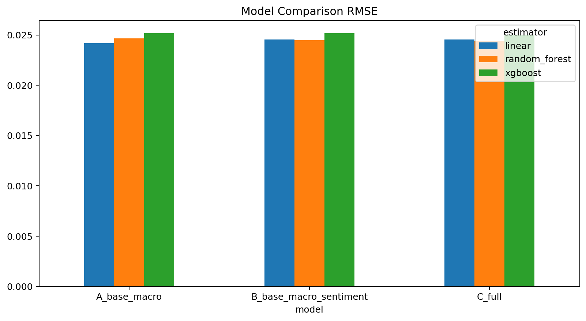
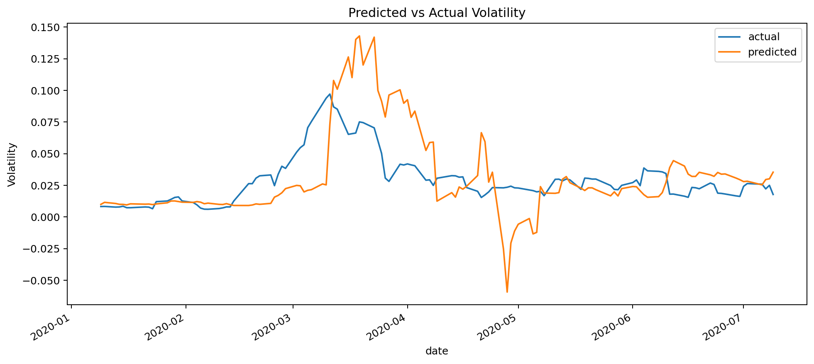
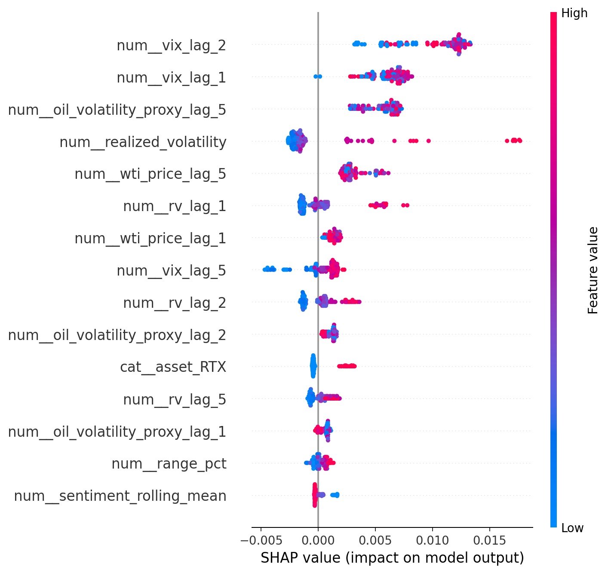
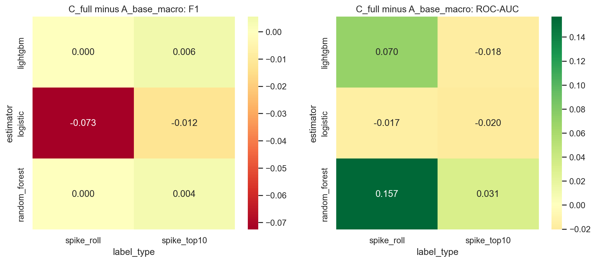
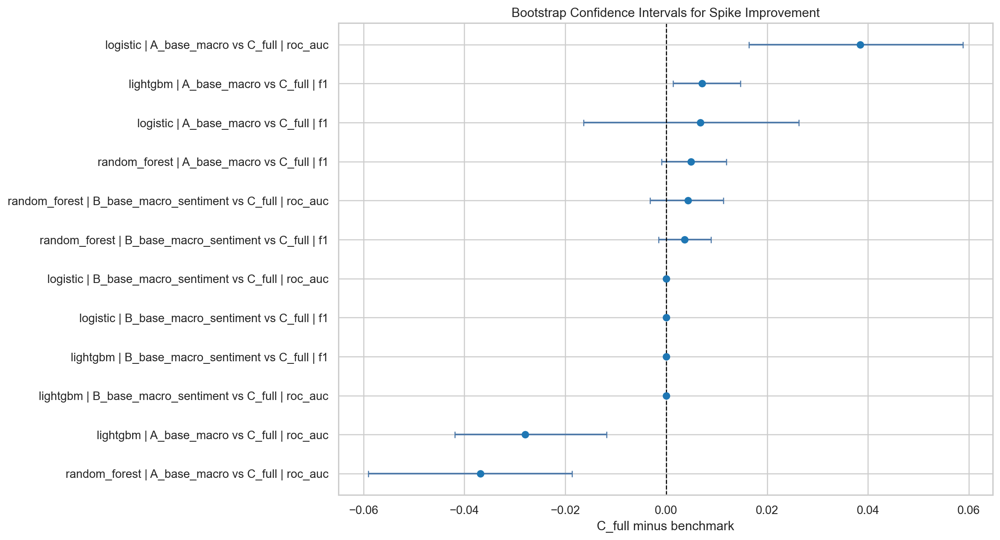
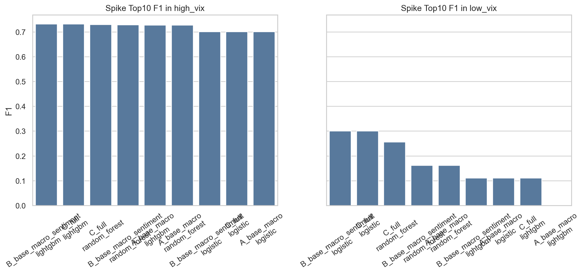
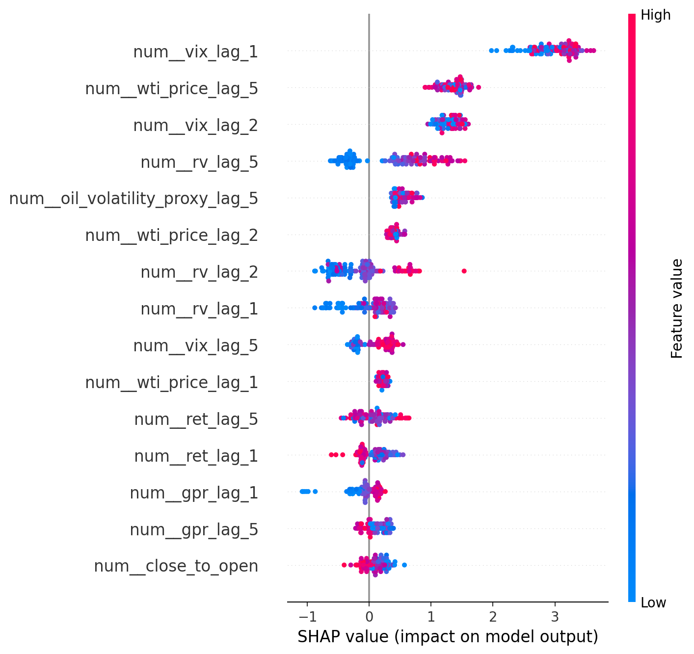
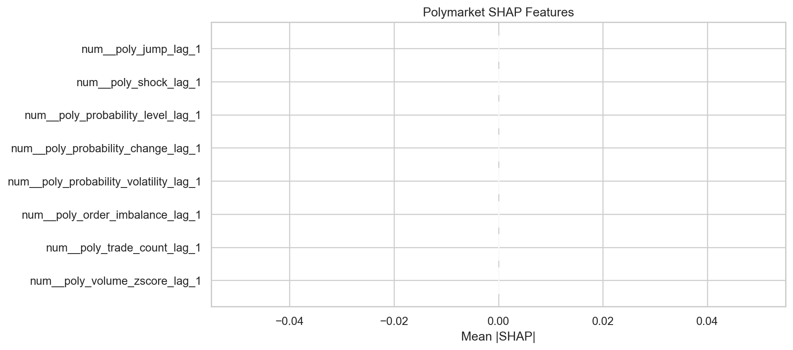
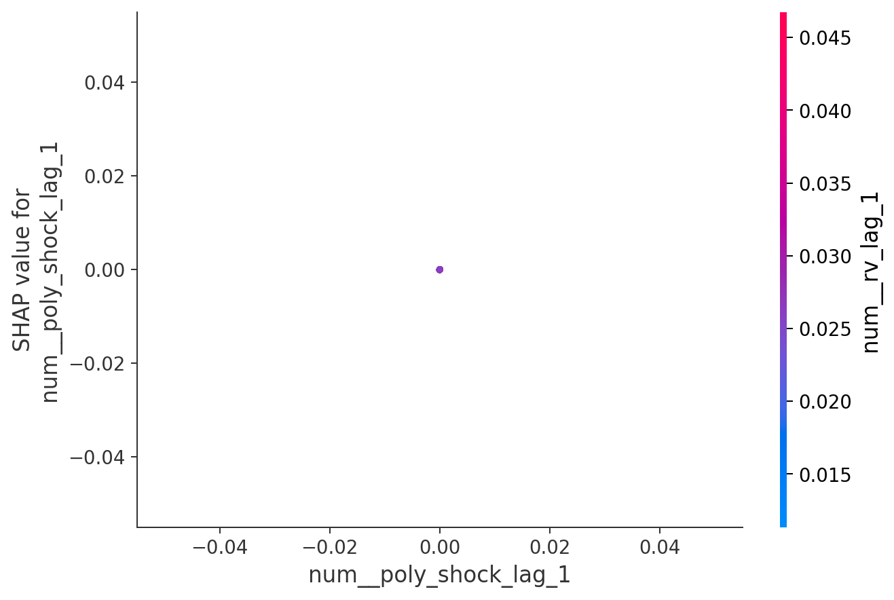

# Polymarket Defense Volatility Research Pipeline

This repository combines:

1. A Polymarket data ingestion stack.
2. A research pipeline for testing whether decentralized prediction market signals improve short-horizon volatility forecasting and volatility spike detection in U.S. defense-related assets.

The project is currently structured as a research-grade workflow rather than only a data-collection repo.

## Research Question

The core question is:

> Do decentralized prediction market probabilities from Polymarket improve short-horizon volatility forecasting and volatility spike prediction for defense assets beyond traditional benchmark variables?

The working conclusion in the current saved outputs is:

- not robustly for broad daily forecasting
- possibly in narrower, regime-sensitive, or event-driven settings

## Intended Research Positioning

The framing is suitable for empirical work aimed at outlets such as:

- *Journal of Prediction Markets*
- *Management Science*
- *American Political Science Review*
- *Journal of International Money and Finance*
- *Journal of Futures Markets*
- *Finance Research Letters*

The current evidence is most naturally aligned with:

- *Journal of Prediction Markets*
- *Journal of Futures Markets*
- *Finance Research Letters*

because the result is nuanced, conditional, and event-sensitive rather than a universal forecasting breakthrough.

## Repository Layers

### 1. Data ingestion
The original repo components collect:

- market metadata from the Polymarket API
- order-filled events from Goldsky
- processed trade records with price and side information

### 2. Research pipeline
The added research stack runs:

- volatility forecasting regression
- volatility spike classification
- feature-set ablation
- regime analysis
- event studies
- statistical testing
- SHAP analysis
- plot and report generation

## Repository Layout

```text
poly_data/
├── update_all.py
├── update_utils/
├── poly_utils/
├── research_pipeline/
│   ├── config.py
│   ├── data.py
│   ├── data_loading.py
│   ├── feature_engineering.py
│   ├── models.py
│   ├── evaluation.py
│   ├── pipeline.py
│   ├── pipeline_v2.py
│   ├── spike_feature_engineering.py
│   ├── spike_models.py
│   ├── spike_evaluation.py
│   ├── spike_pipeline.py
│   └── plot_extras.py
├── run_research_pipeline.py
├── run_spike_pipeline.py
├── generate_extra_plots.py
├── research_data/
└── research_outputs/
```

## Installation

This project uses [UV](https://docs.astral.sh/uv/).

```bash
uv sync
```

Optional notebook extras:

```bash
uv sync --extra dev
```

## Ingestion Workflow

To update the raw Polymarket data:

```bash
uv run python update_all.py
```

This runs:

- `update_markets()`
- `update_goldsky()`
- `process_live()`

## Research Workflows

## 1. Regression pipeline

```bash
uv run python run_research_pipeline.py
```

This runs:

- rolling time-series regression
- benchmark vs sentiment vs Polymarket feature-set comparison
- Diebold-Mariano testing
- SHAP explainability

## 2. Spike-classification pipeline

```bash
uv run python run_spike_pipeline.py
```

This runs:

- `spike_roll` classification
- `spike_top10` classification
- precision / recall / F1 / ROC-AUC evaluation
- bootstrap confidence intervals
- McNemar tests
- tolerant `±1 day` timing evaluation
- regime comparison
- SHAP explainability

## 3. Extra plots

```bash
uv run python generate_extra_plots.py
```

## 4. Geopolitical agents prototype

```bash
uv run python run_geopolitical_agents.py --asset LMT --date 2020-06-15
```

This is a research-only Tauric-inspired roundtable that uses your existing Polymarket panel as context and supports only:

- Groq via OpenAI-compatible chat
- local OpenAI-compatible model endpoints

It does not place trades. It generates:

- a `polymarket_analyst` memo
- a `macro_analyst` memo
- a quota-friendly roundtable synthesis containing:
  - a `bull_researcher` case
  - a `bear_researcher` case
  - a final `research_manager`-style verdict

Optional source-note injection:

```bash
uv run python run_geopolitical_agents.py --asset RTX --date 2020-06-15 --source-note "C:/path/to/source.md"
```

## Paper-Style Profile

The code now includes a paper-style configuration helper:

- `paper_2020_profile()`

This is designed to move the code closer to the study layout described in the paper draft:

- date range: `2020-01-02` to `2020-07-31`
- assets:
  - `RTX`
  - `LMT`
  - `NOC`
- 60-day train window
- 30-day held-out test window

This helper makes the code more paper-aligned, but the existing saved outputs in the repo were not all regenerated under that exact profile.

## Dataset

The main research panel is:

- [research_data/processed/model_dataset.csv](research_data/processed/model_dataset.csv)

It is a `date × asset` panel containing:

- market features:
  - `log_return`
  - `realized_volatility`
  - `target_forward_volatility`
  - `volume_change`
  - `range_pct`
  - `close_to_open`
- Polymarket features:
  - `poly_probability_level`
  - `poly_probability_change`
  - `poly_probability_volatility`
  - `poly_order_imbalance`
  - `poly_trade_count`
  - `poly_volume_zscore`
  - `poly_daily_volume`
  - `poly_market_count`
  - `regime`
- macro features:
  - `vix`
  - `oil_volatility_proxy`
  - `wti_price`
  - `gpr`
  - optional Treasury-yield support in code
- sentiment features:
  - `sentiment`
  - `sentiment_change`
  - `sentiment_rolling_mean`
- lagged controls:
  - `*_lag_1`
  - `*_lag_2`
  - `*_lag_5`

## Methodology Summary

### Regression task
Target:

- `target_forward_volatility`

Feature sets:

- `A_base_macro`
- `B_base_macro_sentiment`
- `C_full`

Estimators:

- Linear Regression
- Random Forest
- XGBoost

Metrics:

- RMSE
- MAE
- R²
- directional accuracy

Inference:

- Diebold-Mariano tests

### Spike task
Labels:

- `spike_roll`
- `spike_top10`

Additional event-sensitive Polymarket features:

- `poly_shock`
- `poly_jump`

Estimators:

- Logistic Regression
- Random Forest
- LightGBM

Metrics:

- precision
- recall
- F1
- ROC-AUC
- confusion counts
- tolerant event scoring

Inference:

- bootstrap confidence intervals
- McNemar tests

## Key Outputs

### Main writeups

- [research_outputs/text/methodology_and_findings.md](research_outputs/text/methodology_and_findings.md)
- [research_outputs/text/paper_vs_pipeline_comparison.md](research_outputs/text/paper_vs_pipeline_comparison.md)
- [research_outputs/text/final_summary.txt](research_outputs/text/final_summary.txt)
- [research_outputs/text/spike_final_summary.txt](research_outputs/text/spike_final_summary.txt)
- [research_outputs/text/geopolitical_agents_prototype.md](research_outputs/text/geopolitical_agents_prototype.md)

### Main tables

- [research_outputs/tables/model_comparison.csv](research_outputs/tables/model_comparison.csv)
- [research_outputs/tables/diebold_mariano_results.csv](research_outputs/tables/diebold_mariano_results.csv)
- [research_outputs/tables/spike_model_comparison.csv](research_outputs/tables/spike_model_comparison.csv)
- [research_outputs/tables/spike_bootstrap_results.csv](research_outputs/tables/spike_bootstrap_results.csv)
- [research_outputs/tables/spike_mcnemar_results.csv](research_outputs/tables/spike_mcnemar_results.csv)
- [research_outputs/tables/spike_regime_comparison.csv](research_outputs/tables/spike_regime_comparison.csv)
- [research_outputs/tables/spike_shap_importance.csv](research_outputs/tables/spike_shap_importance.csv)

### Plots

- [research_outputs/plots](research_outputs/plots)

### Geopolitical roundtable artifacts

- `research_outputs/geopolitical_agents/*.json`
- `research_outputs/geopolitical_agents/*.md`

Useful plot files include:

- `spike_improvement_heatmaps.png`
- `spike_bootstrap_forest.png`
- `spike_regime_f1_bars.png`
- `spike_shap_top15.png`
- `spike_shap_poly_only.png`
- `spike_event_study.png`
- `shap_summary.png`
- `spike_shap_summary.png`

## Results At A Glance

### Regression headline

- Best overall regression model: `A_base_macro + linear`
- Best overall RMSE: `0.024193`
- Best `C_full` RMSE: `0.024369`
- Best matching simpler non-linear benchmark: `A_base_macro + random_forest` with RMSE `0.024648`
- Interpretation: Polymarket features improved some matched comparisons, but they did not produce the single best overall continuous volatility forecast.





### Spike-classification headline

- Main label used for summary: `spike_top10`
- Best overall spike model: `A_base_macro + logistic`
- Best overall F1: `0.655090`
- Best `C_full` F1: `0.642701`
- Bootstrap significance for broad `C_full` improvement: `NO`
- McNemar significance for broad `C_full` improvement: `NO`
- Interpretation: Polymarket helps in some local settings, but not as a robust overall improvement in rare-event spike detection.





### SHAP takeaways

- Top regression Polymarket SHAP features:
  - `poly_probability_change_lag_1`
  - `poly_probability_level_lag_1`
  - `poly_order_imbalance_lag_1`
- Top spike-model Polymarket SHAP features:
  - `poly_volume_zscore_lag_1`
  - `poly_trade_count_lag_1`
  - `poly_order_imbalance_lag_1`
- Interpretation: Polymarket variables are informative, but their contribution is mostly conditional and not strong enough to dominate benchmark variables across the full sample.





## Selected Plot Gallery

- [event_study.png](research_outputs/plots/event_study.png)
- [regime_comparison.png](research_outputs/plots/regime_comparison.png)
- [rmse_by_model_and_regime.png](research_outputs/plots/rmse_by_model_and_regime.png)
- [shap_dependence_polymarket_probability.png](research_outputs/plots/shap_dependence_polymarket_probability.png)
- [spike_event_study.png](research_outputs/plots/spike_event_study.png)
- [spike_model_rankings.png](research_outputs/plots/spike_model_rankings.png)
- [spike_predicted_vs_actual.png](research_outputs/plots/spike_predicted_vs_actual.png)
- [spike_regime_comparison.png](research_outputs/plots/spike_regime_comparison.png)
- [spike_shap_top15.png](research_outputs/plots/spike_shap_top15.png)

## Current Empirical Takeaway

### Regression
Polymarket features were informative and improved some matched benchmark comparisons, but they did not produce the single best overall continuous volatility forecast in the saved run.

### Spike detection
Polymarket features did not produce a broad, statistically robust overall improvement in spike prediction, although they appear more useful in higher-volatility or event-driven settings.

### Best high-level interpretation
Polymarket is best viewed as:

- a supplementary event-risk indicator
- a conditional regime signal
- an early-warning overlay

rather than as a universally dominant daily forecasting input.

## Notes

- Raw download caches under `research_data/raw/` are ignored by Git.
- Large source data are handled with lazy execution and split-wise materialization.
- The repo now contains both ingestion logic and research outputs.

## Troubleshooting

### Missing research outputs
Run:

```bash
uv run python run_research_pipeline.py
uv run python run_spike_pipeline.py
uv run python generate_extra_plots.py
```

### Missing raw Polymarket data
Run:

```bash
uv run python update_all.py
```

## License

Go wild with it.
